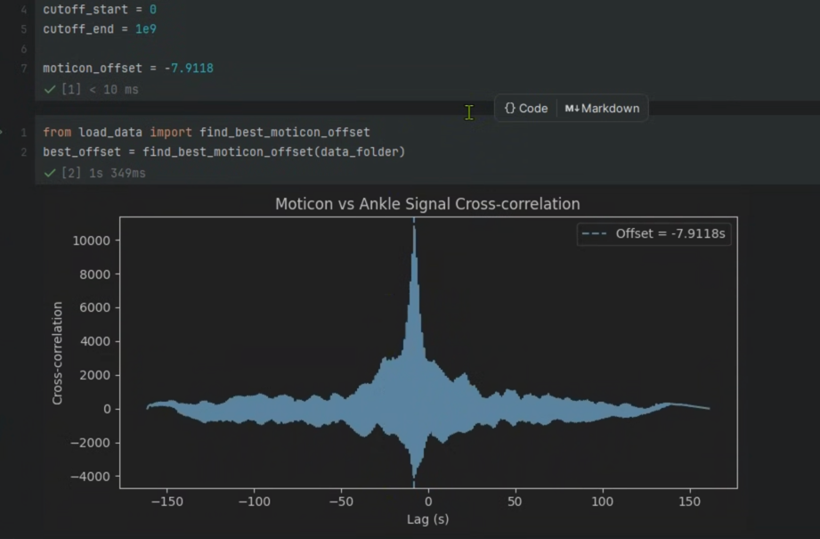
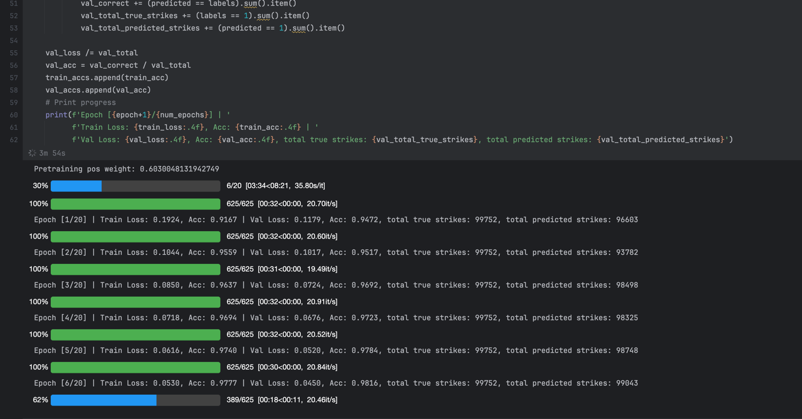

# Stroke Outpatient Rehabilitation: Measuring Progress using Ankle Range of Motion

#### Contact Michael for any questions! [myang9@nd.edu](mailto:myang9@nd.edu)

Run with CircuitPython on Feather nRF52840, with connections to the Adafruit microSD breakout board as well as 2 BNO085 IMUs, one of them have its I2C address jumped. If you have the Foot PCB these are wired inside.\
Segment Strides/classify activities using deep learning with PyTorch.

[Project Document](https://docs.google.com/document/d/1W_u-EETFl5g0VrPbvCA_e4A7lP8_Y1Yrq45xGlHE_Yg/edit#heading=h.p52diav6v98f)

[Fusion Folder](https://mynd483.autodesk360.com/g/projects/20240519767317756/data/dXJuOmFkc2sud2lwcHJvZDpmcy5mb2xkZXI6Y28uY2M0ZkN0QkVSeVc1YURQWVN5Zk9Pdw) If the link doesn't work go to the Wearbale Robotics Lab Fusion Team and select AnkleROM.

### Setup for Code Editing (only tested for Pycharm, go sign up for a free pro license using your .edu email!)
#### Onboard Software (`BNOSD.py`)
The project uses CircuitPython as the code platform for the nRF52840. This is because of a lack of support for the BNO08x arduino library for multiple IMUs. I also personally find CircuitPython easier to work with.

To set up your computer to edit CircuitPython efficiently, I highly recommend Pycharm as the code editor. Here is a [Guide](https://learn.adafruit.com/welcome-to-circuitpython/pycharm-and-circuitpython) to setting it up. Click through various tabs on explanations on how to use tools like `screen` to connect to serial output.

The basics of CircuitPython code editing is based on the `code.py` in a mounted drive when connected to the feather. Look through this [Guide](https://learn.adafruit.com/welcome-to-circuitpython/the-circuitpy-drive) for more details.

The data collection code uses vaiours libraries including [`adafruit_bno08x.i2c`](https://docs.circuitpython.org/projects/bno08x/en/latest/api.html#adafruit_bno08x.BNO08X) and [`sdcardio`](https://docs.circuitpython.org/en/latest/shared-bindings/sdcardio/index.html). Look through the documentation for various methods of the library.


#### Analysis Software (everything else)
The ones you should focus on is `StrideSegmentation.ipynb` and `ActivityClassification.ipynb`.
The workflow for new data is as follows:
1. After data collection, create a folder under `data/`, and copy over a `sync.ipynb` to find the offset between insole and BNOSD timing. (feel free to use `analysis.py` to visualize/overlay what you have for the trial as a sanity check)
2. With the offset, you create a new entry in `ActivityClassification.ipynb` and `StrideSegmentation.ipynb` to use the data in training/inference. See below for more details.



### How do I run the code?
1. Download all the data from the [google drive](https://drive.google.com/file/d/1IrDQVUe4bQDgNEqCXQeAWZPyHjXrLeba/view?usp=sharing) and decompress it into a `data/` folder under the project. This include both data collected from Michael and Mohsen, as well as parts of the Camargo Dataset.\
2. Open up Pycharm and setup your project python interpreter (use any env manager you prefer, venv, conda, etc.).\ 
3. Install Requirements by running
```bash
pip install -r requirements.txt
```
4. Open up `StrideSegmentation.ipynb` and `ActivityClassification.ipynb` in Pycharm, and run the cells in order.

